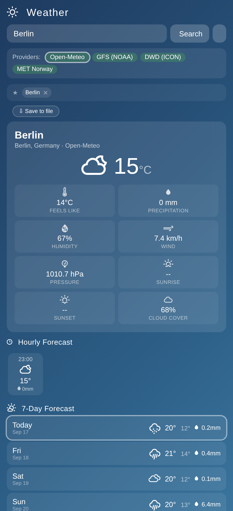

# Weather Widget App

Extract of `Weather_com.weather.app.apk` — an Android "Weather" app with a
home-screen widget and a WebView UI.

## Screenshot



## What this is

This repo is a round-trip reproduction of the APK found at
`~/Downloads/Weather_com.weather.app.apk` (37 KB). The APK is a small Android
app built by an online "HTML/website-to-APK" style builder; it differs from the
`weather-app` repo (WeatherScope, Capacitor) and is based on an earlier
generation of the weather web app.

- **Package:** `com.weather.app`
- **App label:** `Weather`
- **minSdk / targetSdk:** 24 / 36
- **Component:** home-screen **app widget** + `MainActivity` WebView
- **Permissions:** INTERNET, ACCESS_FINE_LOCATION, ACCESS_COARSE_LOCATION, ACCESS_NETWORK_STATE
- **Web app build date:** 2026-07-14, dex 2026-07-17

## Underlying HTML app

`index.html` (copy of `assets/weather.html`) is the single-file web app the APK
displays. It is self-contained (CDN styles/scripts) and:

- Uses **Open-Meteo** as the weather provider (current + hourly, selects GFS/ICON/etc. models)
- Shows a **Leaflet radar/map** view
- Has location **search** with geocoding plus favorite locations
- Renders WMO icons, precipitation and hourly forecast
- Contains **no API keys** (Open-Meteo requires none)

## Layout

```
index.html             underlying web app (extracted from assets/weather.html)
assets/weather.html    raw asset inside the APK
AndroidManifest.xml    binary AXML manifest from the APK
classes.dex            compiled DEX (Java/Kotlin, WebView + widget host)
res/                   widget + launcher resources (binary XML, PNG icons)
resources.arsc         compiled resources table
META-INF/              signature (WEATHER.RSA / WEATHER.SF)
```

## How to reproduce

```sh
unzip -o ~/Downloads/Weather_com.weather.app.apk -d weather-widget-app
# verify manifest
aapt dump badging Weather_com.weather.app.apk
```

## Notes

- All binary Android files are committed as extracted (unmodified).
- No git history carries any credentials; the repo was seeded only with this
  APK's contents plus this README.